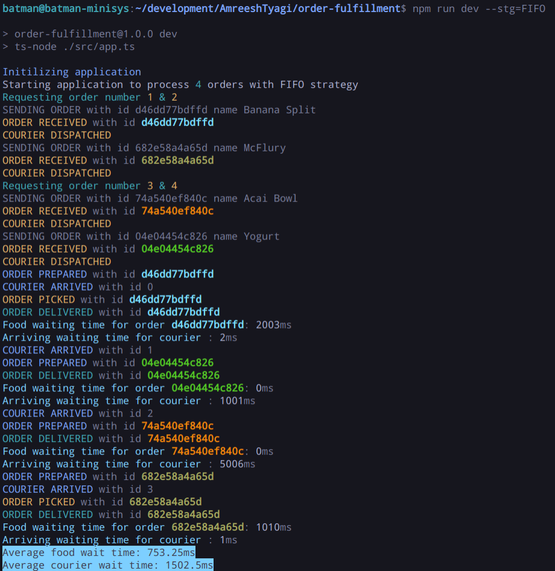
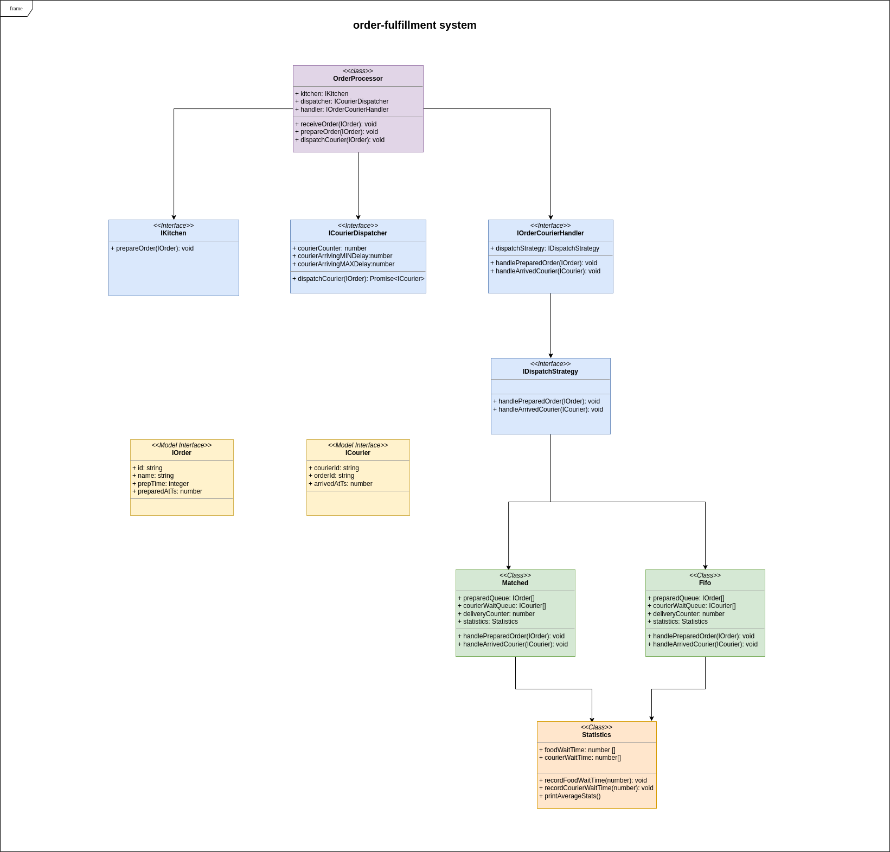

# order-fulfillment real time simulation service

## Getting started

### **Install framework**
This project is based on Nodejs. So you need to install Nodejs LTS and NPM first on you host machine from [here](https://nodejs.org/en/download/). Make sure to check `npm -v` command. It should work after nodejs installation.


### **Clone application on local machine**
```sh
git clone git@github.com:AmreeshTyagi/order-fulfillment.git
```
### **Install application and dependencies**

```sh
npm install
```
This command will install all dependencies & dev dependencies.

### **Run application**

This application can be run with or without passing any runtime arguments.

1. Running with **FIFO strategy**
   ```sh
   npm run dev --strategy=FIFO
   ```
2. Running with **MATCHED strategy**
   ```sh
   npm run dev --strategy=MATCHED
   ```
3. Runnig without any arguments. Default setting is **FIFO**
    ```sh
   npm run dev
   ```

### **Unit tests**
Jest framework for Unit testing. You can modify jest settings from `jest.config.js` as per your need.

To run test execute:
```sh
npm run test
```

### **Results**

You will see results like below, which will give you information about all order processing statuses along with food wait time & arriving wait time for every order and average of them once all orders are delivered.




### **Class diagram**



### **Author**
Amreesh Tyagi

### **License**
[MIT](https://github.com/AmreeshTyagi/order-fulfillment/blob/main/LICENSE)